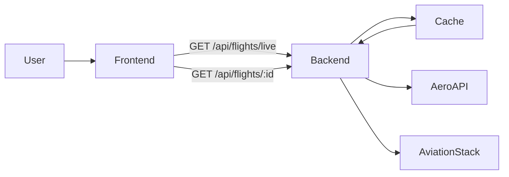
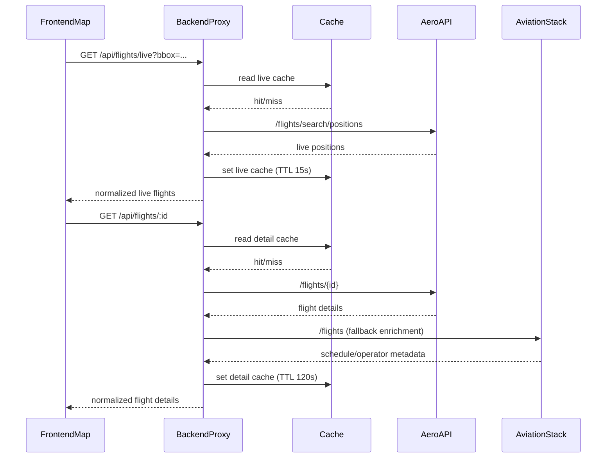

# FlightAware Live Aircraft Integration

## Architecture





## Recommended AeroAPI Endpoints

### Live positions
`GET https://aeroapi.flightaware.com/aeroapi/flights/search/positions`

Required headers:
- `x-apikey: <AEROAPI_KEY>`

Sample request:
```
GET /aeroapi/flights/search/positions
  ?query={range lat -45 -10} {range lon 110 155} {true inAir} {>= alt 0}
  &max_pages=2
```

Sample response shape (truncated):
```
{
  "positions": [
    {
      "fa_flight_id": "FA1234567",
      "ident": "QFA10",
      "ident_iata": "QF10",
      "origin": { "icao": "YMML", "iata": "MEL" },
      "destination": { "icao": "EGLL", "iata": "LHR" },
      "latitude": -33.9,
      "longitude": 151.2,
      "altitude": 36000,
      "groundspeed": 480,
      "heading": 45,
      "last_position_time": "2026-01-16T09:12:01Z"
    }
  ]
}
```

### Flight details
`GET https://aeroapi.flightaware.com/aeroapi/flights/{fa_flight_id}`

Sample response shape (truncated):
```
{
  "flights": [
    {
      "fa_flight_id": "FA1234567",
      "ident": "QFA10",
      "origin": { "icao": "YMML", "iata": "MEL", "name": "Melbourne" },
      "destination": { "icao": "EGLL", "iata": "LHR", "name": "Heathrow" },
      "scheduled_out": "2026-01-16T08:40:00Z",
      "estimated_out": "2026-01-16T08:55:00Z",
      "actual_out": "2026-01-16T08:57:00Z"
    }
  ]
}
```

### Enrichment
- `GET /airports/{code}` for airport name/timezone
- `GET /operators/{icao}` for airline/operator metadata

## AviationStack Fallback
`GET http://api.aviationstack.com/v1/flights?access_key=...&flight_iata=QF10&limit=1`

Fallback is used to fill missing fields:
- airline name, IATA/ICAO
- departure/arrival airport names + timezones
- scheduled/estimated/actual times
- status (enroute/landed/delayed)

## Backend Endpoints

### `GET /api/flights/live`
Query params:
- `bbox`: `minLat,minLon,maxLat,maxLon`
- `region`: `GLOBAL`, `UK_EU`, `AU`
- `airline`, `minAltitude`, `maxAltitude`, `minSpeed`, `maxSpeed`, `destinationCountry`, `max`

Response:
```
{
  "region": "global",
  "updatedAt": "2026-01-16T09:12:08.000Z",
  "stale": false,
  "source": "aeroapi",
  "flights": [
    {
      "id": "FA1234567",
      "callsign": "QFA10",
      "flightNumber": "QF10",
      "operator": { "name": "Qantas", "iata": "QF", "icao": "QFA" },
      "origin": { "iata": "MEL", "icao": "YMML" },
      "destination": { "iata": "LHR", "icao": "EGLL" },
      "position": {
        "latitude": -33.9,
        "longitude": 151.2,
        "altitude": 36000,
        "groundSpeed": 480,
        "heading": 45,
        "timestamp": "2026-01-16T09:12:01Z"
      }
    }
  ]
}
```

### `GET /api/flights/:id`
Response:
```
{
  "updatedAt": "2026-01-16T09:12:15.000Z",
  "stale": false,
  "source": "aeroapi",
  "flight": {
    "id": "FA1234567",
    "flightNumber": "QF10",
    "operator": { "name": "Qantas", "iata": "QF", "icao": "QFA" },
    "origin": { "iata": "MEL", "name": "Melbourne" },
    "destination": { "iata": "LHR", "name": "Heathrow" },
    "status": "enroute",
    "position": { "latitude": -33.9, "longitude": 151.2 },
    "scheduled": { "off": "...", "on": "..." },
    "estimated": { "off": "...", "on": "..." },
    "actual": { "off": "...", "on": "..." }
  }
}
```

## Data Mapping Rules

### AeroAPI → normalized
- `fa_flight_id` → `id`
- `ident` / `ident_iata` → `callsign` / `flightNumber`
- `origin` / `origin_iata` / `origin_icao` → `origin`
- `destination` / `destination_iata` / `destination_icao` → `destination`
- `latitude`, `longitude`, `altitude`, `groundspeed`, `heading` → `position`
- `scheduled_out`, `estimated_out`, `actual_out` → `scheduled.off`, `estimated.off`, `actual.off`
- `scheduled_in`, `estimated_in`, `actual_in` → `scheduled.on`, `estimated.on`, `actual.on`

### AviationStack fallback
- `airline.name`, `airline.iata`, `airline.icao` → `operator`
- `departure.airport`, `departure.iata`, `departure.icao` → `origin`
- `arrival.airport`, `arrival.iata`, `arrival.icao` → `destination`
- `departure.scheduled/estimated/actual` → `scheduled.off` / `estimated.off` / `actual.off`
- `arrival.scheduled/estimated/actual` → `scheduled.on` / `estimated.on` / `actual.on`
- `flight_status` → `status`

## Caching & Rate Limit Strategy
- Live positions: TTL 15s, max pages 1–3
- Flight details: TTL 120s
- If AeroAPI returns error or 429, serve cached data with `stale: true`
- Redis used when `REDIS_URL` is present; in-memory fallback otherwise

## Environment Variables
- `AEROAPI_KEY`
- `AEROAPI_BASE_URL` (default `https://aeroapi.flightaware.com/aeroapi`)
- `AVIATIONSTACK_KEY` (optional)
- `AVIATIONSTACK_BASE_URL` (default `http://api.aviationstack.com/v1`)
- `REDIS_URL` (optional)

## Acceptance Criteria
- Live aircraft layer updates every ~15s and animates smoothly between updates.
- Aircraft icons rotate based on heading and cluster when zoomed out.
- Clicking a plane opens a details panel with call sign, route, altitude, speed, heading, position, timestamp, and status.
- UI handles empty states and API errors gracefully.
- API keys are never exposed to the frontend; backend calls external APIs.
- Cache is used to reduce duplicate API calls and handle rate limits.

## Test Plan
- Backend:
  - Unit test: `normalizeLiveFlight` and `normalizeFlightDetails` mapping.
  - Unit test: cache fallback returns `stale: true` when API fails.
  - Manual: set `AEROAPI_KEY` and verify `/api/flights/live` returns results.
- Frontend:
  - Manual: toggle Live Flights on/off, check map layer visibility.
  - Manual: click a plane and confirm details panel fields populate.
  - Manual: simulate API failure and confirm error messaging.
